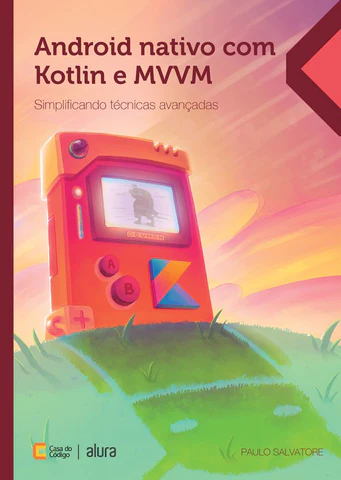

# Android Nativo com Kotlin e MVVM: Simplificando técnicas avançadas

[Página do Livro, na Casa do Código](https://www.casadocodigo.com.br/products/livro-android-nativo)

Boas vindas ao repositório oficial do livro "Android Nativo com Kotlin e MVVM: Simplificando técnicas avançadas", escrito por Paulo Salvatore e publicado pela editora Casa do Código. Este livro e repositório visam proporcionar um aprendizado prático e avançado em desenvolvimento Android, usando Kotlin e o padrão de arquitetura MVVM.

## Sobre o Livro

A ascensão do Android como a plataforma móvel mais popular do mundo aumentou a demanda por desenvolvedores e desenvolvedoras proficientes nessa área. Saber construir aplicativos nativos para Android, empregando conceitos avançados da linguagem Kotlin, com a escolha arquitetural adequada e um conjunto de bibliotecas poderosas, tornou-se uma habilidade crucial para quem quer ter um diferencial competitivo. Dominando essas ferramentas com profundidade, você terá todo o alicerce para a criação de soluções eficientes, robustas e escaláveis para os desafios do mundo real.

Neste livro, Paulo Salvatore oferece um guia completo para nos conduzir por uma jornada de descoberta e aprendizado avançado em desenvolvimento Android. Você vai mergulhar no universo fascinante do DevMon, um projeto inspirado na Pokédex do universo Pokémon™, com muitas pitadas de tecnologia, desbravando os segredos da linguagem Kotlin e do padrão de arquitetura MVVM, além de explorar bibliotecas como Navigation, Retrofit, GSON, Hilt, RX e Glide. Ao longo da implementação, você acompanhará a aplicação prática desde o início do projeto até técnicas avançadas, passando pela construção do fluxo de navegação, a criação da lista de criaturas mágicas, o uso de Data Binding e a integração com back-end, finalizando com a conexão a uma API web. Prepare-se para evoluir suas habilidades em desenvolvimento de software!

## Como Usar Este Repositório

Este repositório é organizado em várias branches para facilitar o acompanhamento do conteúdo do livro:

- **main**: Branch principal com o README e instruções gerais.
- **my-project**: A branch para você começar a trabalhar e criar seu projeto baseado no livro.
- **project-complete**: A versão final do projeto conforme o último capítulo do livro.
- **all-chapters**: Contém o projeto completo, com todos os capítulos organizados em módulos separados, ideal para uma visão global.
- **project-complete-with-extras**: A versão completa do projeto com recursos adicionais implementados. Inclui banco de dados Room, funcionalidades como visualização e evolução das criaturas, e interações como brincar, alimentar e treinar.
- **capXX-YYY**: Cada capítulo do livro tem uma branch correspondente (ex: `cap11-api-backend`), que serve como referência e ponto de partida para o capítulo seguinte.

### Trabalhando com as Branches

Ao trabalhar em seu projeto, use a branch `my-project`. Ela possui uma versão minimalista do projeto, apenas com as versões das dependências e a primeira `Activity` criada. Isso facilitará o início no projeto.

## Reportando Erros e Problemas - Issues

Encontrou um erro ou tem uma sugestão? Sinta-se à vontade para [abrir uma issue](https://github.com/FabricaDeSinapse/livro-android-casa-do-codigo/issues/new) neste repositório. Siga estas diretrizes ao criar uma issue:

1. Verifique se a issue já não foi reportada.
2. Seja claro e detalhado na descrição do problema.
3. Inclua informações relevantes como versões de ferramentas, logs de erro, etc.
4. Se possível, adicione um trecho de código ou screenshots para ilustrar o problema.

## Contribuições

Este projeto é um recurso comunitário para aprendizado e melhoria contínua. Contribuições são bem-vindas. Veja como você pode contribuir:

1. Fork o repositório.
2. Faça suas alterações.
3. Envie um Pull Request com uma descrição clara das modificações.

## Licença

Este projeto esta licenciado sob a [MIT License](LICENSE).

## Sobre o Autor

[Paulo Salvatore](https://linktr.ee/PauloSalvatore) é professor e desenvolvedor com mais de 10 anos de experiência em desenvolvimento de softwares, jogos e liderança tecnológica, atuando como CTO tanto no Brasil quanto no exterior. Focado em compartilhar sua experiência por meio de uma linguagem fácil e acessível, é especializado em diversas tecnologias como desenvolvimento Android, Realidade Virtual, Inteligência Artificial, criação de sites (front-end e back-end) e design de Games. Saiba mais sobre ele em seu [GitHub](https://github.com/paulosalvatore) ou [LinkedIn](https://www.linkedin.com/in/salvatorepaulodev/).
